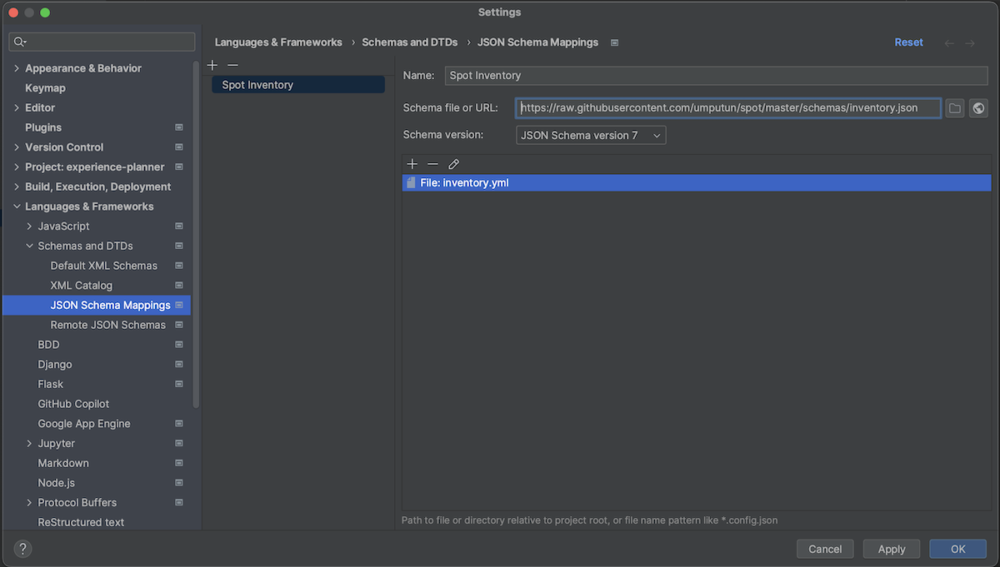

# Schemas

JSON Schema definitions for inventory and playbook

# VSCode setup

1. Install [plugin](https://marketplace.visualstudio.com/items?itemName=redhat.vscode-yaml) for YAML support
2. Associate schemas with files - [documentation](https://github.com/redhat-developer/vscode-yaml#associating-a-schema-in-the-yaml-file)  
    Example  
    ```json
    {
        "yaml.schemas": {
            "https://raw.githubusercontent.com/umputun/spot/master/schemas/inventory.json": "inventory.yml",
            "https://raw.githubusercontent.com/umputun/spot/master/schemas/playbook.json": "spot.yml"
        }
    }
    ```

# IDEA-based IDE setup

1. Add custom JSON Schema - [documentation](https://www.jetbrains.com/help/idea/json.html#ws_json_schema_add_custom)  
   Example  
   